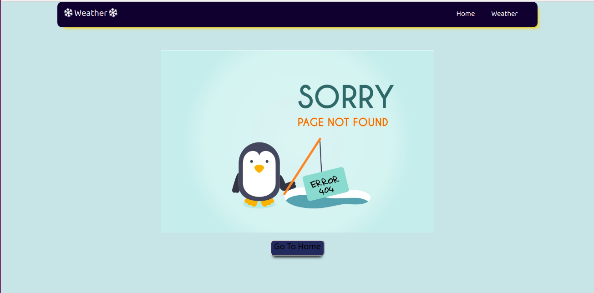
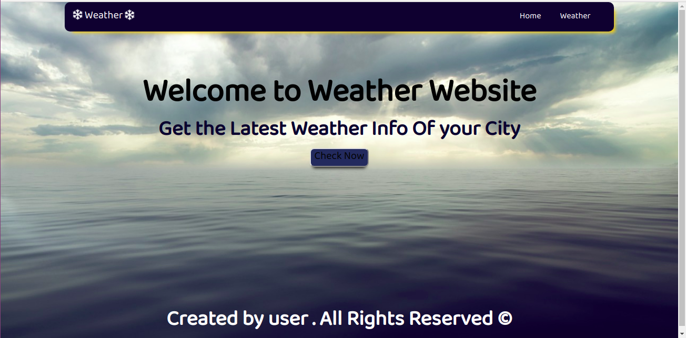
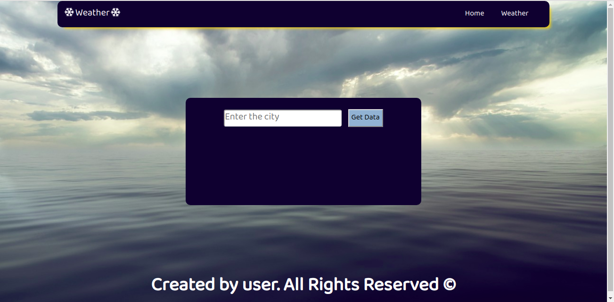

# Simple_Weather_Website_using_Express.js
This is a simple weather displaying website that uses Express.Js as a backend and uses a real time API to fetch data .

This is a simple project which gives the weather of a city in real time by fetching data using a API

HTML and basic Javascript has been used for designing the UI.

Sample APi for Delhi City

API used is --  http://api.openweathermap.org/data/2.5/weather?q=Delhi,in&appid=019e4f24f851f9ec78ddc828de419a2e

# UI of the Project

